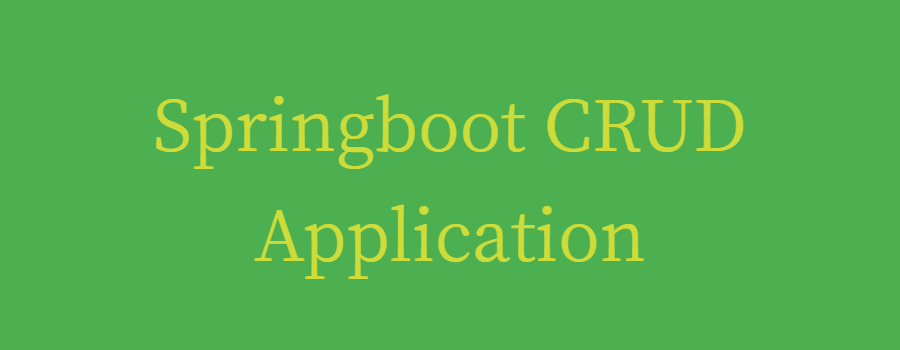

This repository contains a simple Spring Boot CRUD (Create, Read, Update, Delete) application.

## Table of Contents

- [Features](#features)
- [Technologies Used](#technologies-used)
- [Setup](#setup)
- [Usage](#usage)
- [Endpoints](#endpoints)
- [License](#license)

## Features

- **CRUD Operations:** Perform Create, Read, Update, and Delete operations on data.
- **RESTful API:** Exposes RESTful endpoints for interacting with the application.
- **Spring Boot:** Utilizes the Spring Boot framework for easy setup and development.

## Technologies Used

- Java
- Spring Boot
- Spring Data JPA
- MySQL (or your preferred database)
- Maven (or Gradle)

## Setup

1. **Clone the repository:**

    ```bash
    git clone https://github.com/danthalomous/CST339_MilestoneProject
    ```

2. **Navigate to the project directory:**

    ```bash
    cd CST339_MilestoneProject
    ```

3. **Configure the database:**

    - Create a MySQL database (or use an existing one).
    - Update the database configuration in `src/main/resources/application.properties`.

4. **Build the project:**

    ```bash
    mvn clean install
    ```

5. **Run the application:**

    ```bash
    java -jar target/spring-boot-crud-1.0.jar
    ```

## Usage

Once the application is up and running, you can interact with it via its RESTful API. Use tools like Postman or curl to send HTTP requests to the endpoints.

## Endpoints

- **GET /api/entities:** Retrieve all entities.
- **GET /api/entities/{id}:** Retrieve an entity by ID.
- **POST /api/entities:** Create a new entity.
- **PUT /api/entities/{id}:** Update an existing entity.
- **DELETE /api/entities/{id}:** Delete an entity by ID.

Replace `entities` with the actual resource name in your application.
